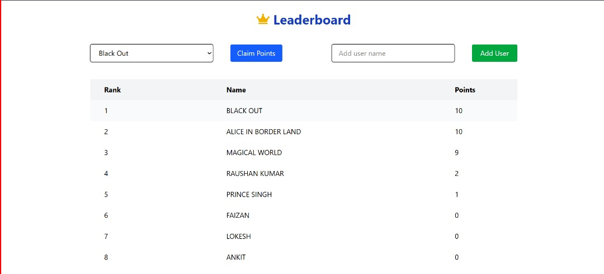
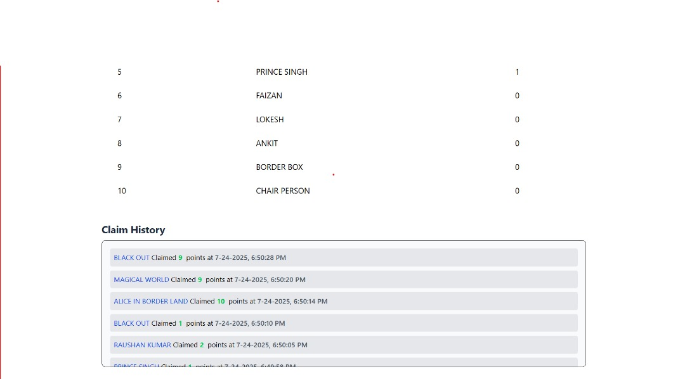

# 🏆 Leaderboard App

Live Demo 👉 [https://leader-board-gla6.vercel.app/](https://leader-board-gla6.vercel.app/)

A real-time leaderboard web application where users can add themselves, claim points, and view their activity history. Built with MERN stack & modern UI tools.

---

## 📸 Screenshots

### 📊 Leaderboard UI

### 📜 Claim History

---

## 🛠️ Tech Stack

### Frontend
- **React 19**
- **Redux Toolkit** – State Management
- **Tailwind CSS** – Utility-First CSS Framework
- **Vite** – Fast Development Server
- **Axios** – API Requests
- **React Hot Toast** – Toast Notifications
- **React Icons**

### Backend
- **Node.js + Express**
- **MongoDB** – NoSQL Database

### Tooling
- **ESLint** – Linting & Code Quality
- **@tailwindcss/vite** – Vite + Tailwind Integration

---

## 🚀 Features

- 🔼 Add yourself to the leaderboard.
- 🎯 Claim points daily / periodically.
- 📈 View your complete claim history.
- 📦 Real-time updates (Redux state)
- ✅ Input validation and toast notifications.
- 📱 Mobile-first, sleek and responsive design.
- 🔐 Secure API with backend validations.

---

## 🧪 Local Development

To run this project locally:

### 1. Clone the Repository

